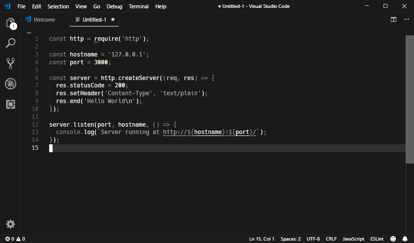

# Monochrome Dark

A simple dark monochrome color theme, inspired by in-the-box's [Simple Dark Mode](https://github.com/in-the-box/vscode-simple-dark-mode) theme for VS Code, and anler's [Minimal Theme](https://github.com/anler/minimal-theme) for Emacs.

It is code, not fruit salad.

## References

[VS Code Theme Color API Reference](https://code.visualstudio.com/api/references/theme-color)
